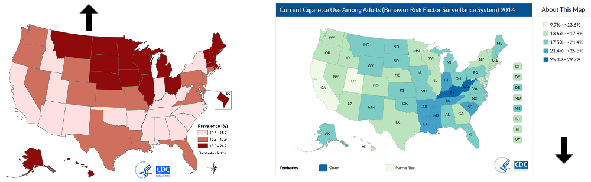
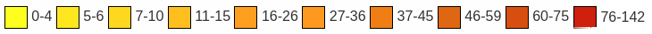
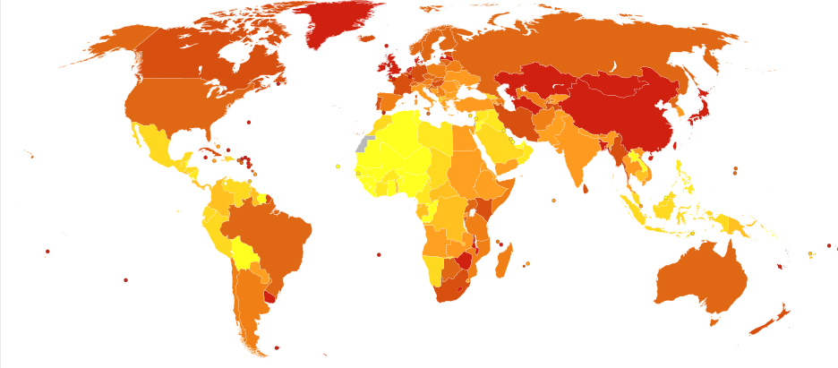

## Our favorite vices ...

**24.9%**: Percent of adults 18 years and over who had at least one heavy drinking day (five or more drinks for men and four or more drinks for women) in 2014.



**16.8%**: Percent of adults 18 years of age and over who smoked cigarettes in 2014.


--- 

## ... can cause some nasty problems.

Death from esophageal cancer per million persons in 2012




---

## "but it won't happen to me!"

```{r results="asis", echo=F, fig.width=10, fig.align='center'}
library(ggplot2)
load(file="../data/DataAndModel.RData")
source("../common.R")
ggplot(esoph, aes(x=tobgp, y=.pred, alpha=alcgp, group=alcgp)) +
    geom_point(size=3) +
    facet_grid(~agegp) +
    labs(title="age range", 
         x="\ntobacco use (g/day)\n", 
         y = "predicted probability of\nesophogeal cancer\n",
         alpha="alcohol use (g/day)") +
    theme(panel.background = element_blank(),
          strip.background=element_blank(),
          panel.grid.major.y = element_line(color="gray90"),
          plot.title=element_text(family="sansserif", size=16),
          axis.title=element_text(family="sansserif", size=16),
          legend.title=element_text(family="sansserif", size=14),
          strip.text=element_text(family="sansserif", size=12),
          legend.text=element_text(family="sansserif", size=12),
          axis.text.x=element_text(family="sansserif", size=10, angle=90),
          legend.position="bottom",
          axis.ticks=element_blank(),
          panel.margin.x=unit(10, "points"),
          panel.border=element_rect(fill=NA, color="gray70")
    ) +
    scale_x_discrete(labels=c("0-9", "10-19", "20-29", "30+")) +
    scale_alpha_discrete(labels=c("0-39", "40-79", "80-119", "120+"))
```

It happens to more than you'd imagine.

---

## Luckily, it's not rocket science

### [Esophageal Cancer Predictor](https://drfloob.shinyapps.io/PredictingEsophagealCancer/)

### Three short questions is all it takes to predict your risk level. 

### Try it today, know your risks.

---

## Acknowledgements

- [cancer map](https://en.wikipedia.org/wiki/Esophageal_cancer#/media/File:Oesophagus_cancer_world_map-Deaths_per_million_persons-WHO2012.svg): Chris55 - Data from World Health Organization Estimated Deaths 2012 Vector map from BlankMap-World6, compact.svg by Canuckguy et al. ([CC BY-SA 4.0](http://creativecommons.org/licenses/by-sa/4.0))

- [binge drinking map](http://www.cdc.gov/alcohol/data-stats.htm): Source: Behavioral Risk Factor Surveillance System

- [tobacco use map](http://www.cdc.gov/tobacco/data_statistics/fact_sheets/adult_data/cig_smoking/index.htm): CDC.gov
 
- [2014 Alcohol Use Statistics in the USA](http://www.cdc.gov/nchs/fastats/alcohol.htm): CDC.gov

- [2014 Cigarette Use Statistics in the USA](http://www.cdc.gov/nchs/fastats/smoking.htm): CDC.gov

