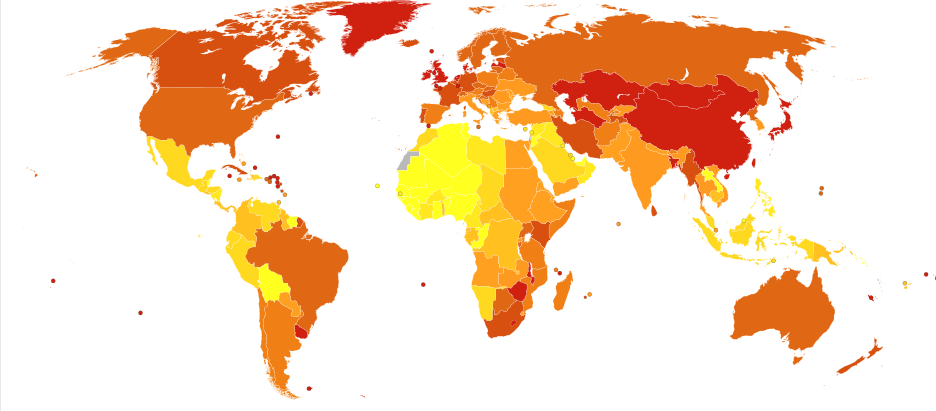

## Our favorite vices ...

**24.9%**: Percent of adults 18 years and over who had at least one heavy drinking day (five or more drinks for men and four or more drinks for women) in 2014.

**16.8%**: Percent of adults 18 years of age and over who smoked cigarettes in 2014.

--- 

## ... can cause some nasty problems.

Death from esophageal cancer per million persons in 2012

---

## "but it won't happen to me!"

It happens to more than you'd imagine.

---

## Luckily, it's not rocket science

### [Esophageal Cancer Predictor](https://drfloob.shinyapps.io/PredictingEsophagealCancer/)

### Three short questions is all it takes to predict your risk level. 

### Try it today, know your risks.

---

## Acknowledgements

- [cancer map](https://en.wikipedia.org/wiki/Esophageal_cancer#/media/File:Oesophagus_cancer_world_map-Deaths_per_million_persons-WHO2012.svg): Chris55 - Data from World Health Organization Estimated Deaths 2012 Vector map from BlankMap-World6, compact.svg by Canuckguy et al. ([CC BY-SA 4.0](http://creativecommons.org/licenses/by-sa/4.0))

- [binge drinking map](http://www.cdc.gov/alcohol/data-stats.htm): Source: Behavioral Risk Factor Surveillance System

- [tobacco use map](http://www.cdc.gov/tobacco/data_statistics/fact_sheets/adult_data/cig_smoking/index.htm): CDC.gov
 
- [2014 Alcohol Use Statistics in the USA](http://www.cdc.gov/nchs/fastats/alcohol.htm): CDC.gov

- [2014 Cigarette Use Statistics in the USA](http://www.cdc.gov/nchs/fastats/smoking.htm): CDC.gov

